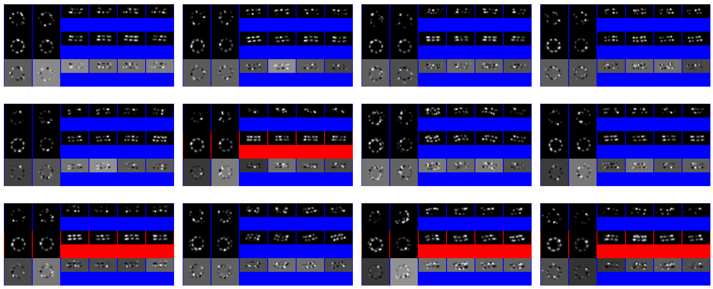
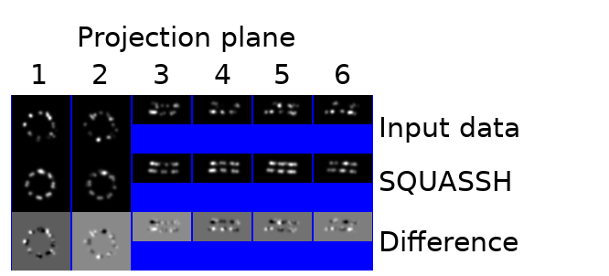
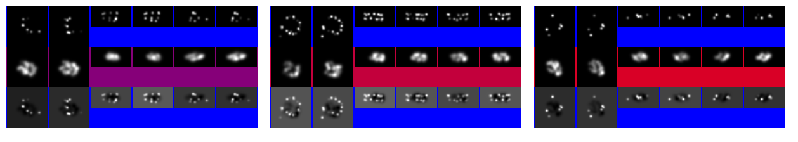

# FAQs

## Is my data suitable for SQUASSH analysis?
SQUASSH analysis is designed to take in segmented patches of the same type of
structure from fluorescence microscopy images of biological samples. It has
been tested on images from multiple different types of fluorescence microscopy,
including SMLM, lattice light sheet, and confocal data. 
 
With regard to other modalities, it should in principle work on SIM data (as
long as it is not a small z stack, which may lead to issues with periodicity
assumptions). It could in principle work on widefield data but changes in the
rendering pipeline may be required. Please contact us if you would like advice
as to whether your dataset is suitable.
 
For SQUASSH analysis to be performed, the structure or structures in each patch
must be non-overlapping. A small number of patches containing overlapping
structures will not cause issues but if this rises above a few % these should
be filtered out.
 
If you are going to be including repeats in your model there can be more than
one of your structures in a patch, repeating along an axis. Otherwise there
should just be a single instance of your structure.

## What factors in my data could mean that SQUASSH might perform poorly?

We currently project the input data into three or six 2D images.  If you have a
large, densely labelled biological structure and you wish to pick up internal
as well as external structure, then six planes may not be enough to provide
detail on the internal structure and it may be necessary to add a new rendering
pipeline which uses more planes.

To get started, look in [train_bunny.py](train_bunny.py) which performs
training on the Stanford Bunny test dataset using single plane, 3 plane and 6
plane rendering. 


The other major limitation for SQUASSH analysis is background. SQUASSH assumes
background to be part of the structure and will include it in the model. In
cases of very high background, this may become the dominant part of the output.
If you have uniform background, you can subtract it before running SQUASSH, but
removing heavily nonuniform background is not trivial.  

## How do I perform my segmentation?
If you wish to analyse your own experimental data, you will first need to
segment out each structure from your image into a patch.

There are two possible ways in which you might perform the segmentation: one if
you will have one structure per patch and the other if you have multiple
repeats of the structure visible in a patch.

### One structure per patch:

For most of the types of data we have used so far, a Gaussian blur plus
thresholding is sufficient to separate out patches. If you wish to take a more
sophisticated approach, a segmentation network such as
[Cellpose](https://www.cellpose.org/) could be used
to identify similar structures using either 3D data or maximum intensity
projections. Once you have identified the areas of interest, you will either
select out the localised positions in that structure (for an SMLM experiment)
or create a list of patches of fixed size, each of which contains one structure
(for other microscopy techniques).

If you are dealing with a small dataset and do not wish to take the time to
develop an automated segmentation pipeline, you could mark up individual
locations and then select 3D regions centred on the selected points.

### Repeating structures in a single patch:

For repeating structures in a single patch, we recommend using a program such
as GIMP (GNU Image Manipulation Program) to perform a markup of those areas of
the image where you believe the data is reliable and good quality. These can
then be split into patches of the required size. An example of this is
available in the code for pre-processing spectrin ring data.

The relavant datasets are the [spectrin](data/leterrier_spectrin/__init__.py)
and [microtubule](data/dan_microtubules/__init__.py) datasets. The
implementation of segmentation is in
[segment_markup.py](data/segment_markup.py).

## How do I pick the starting and final values of my input rendering blur?

Your starting input blur needs to be large enough that the gradients in the
image allow fluorophores to be optimised to approximately the correct location
during early stages of optimisation. Our starting blurs have varied between a
FWHM of 0.16 and 0.36 of the image patch size. We have found no variation in
performance within this range. Setting the initial FWHM much lower (e.g. basing
it on the localisation precision) is not advised as it can lead to low
gradients over much of the image, meaning that fluorophores cannot successfully
localise to the correct position.

For SMLM datasets, the finishing input blur should be a FWHM of around 2-4x the
estimated average localisation precision if this is known. If it is not
possible to estimate the localisation precision accurately we would suggest
between 10nm and 20nm would be appropriate for most datasets. It may be
advisable to err on the side of a higher final blur if you are unsure. It is
important to remember that the rendered images do not need to match the
theoretical best resolution that these images could achieve: they only need to
provide suitable image gradients to allow the positions of the fluorophores to
be optimised.


## How can I evaluate the quality of my SQUASSH analysis?

There are a number of ways that you might choose to evaluate quality.

1. Repeated runs of the same dataset allow you to test how reproducible the results are
2. The proportion of data rejected can give insight into whether most of the
   data can be successfully fitted by the type of model that you have picked.
   The percentage of valid (i.e. not rejected) items is printed after every
   epoch and saved to the log file.
3. The size of the model rendering blur can help to give you insight into
   whether the fitting has been successful. If the rendering model blur remains
   high at the end of the optimisation, it means that the optimisation process
   has not been able to move fluorophores into a position that can be fitted
   successfully at a lower blur. This means that your model (of fluorophores +
   heterogeneity) was not able to fit successfully to your data. 

(2) and (3) can also be viewed by using the montage tool:
```bash
bash log_montage.sh <PATH_TO_LOG_DIRECTORY>
```
This will create a montage of input data, SQUASSH output and the difference for
some of the data. The result will look like this:



A red background corresponds to a rejected sample, and the meaning of the sub
panels is:



An example of a poor quality fit with a high output rendering blur might look 
like the following example:




## How can I analyze SQUASSH results

Analysis will depend on the structure, the heterogeneity and the experiment
being run. Generally speaking, an analysis will involve applying the trained
network to the data once more, and recording the network outputs and performing
some analysis on those.

We have provided a number of complete examples, 
in the 
[Colab notebook](https://colab.research.google.com/github/edrosten/squassh/blob/master/train_nupc_simple.ipynb)
and in the form of files used to
generate some of the figures in the paper from the results of SQUASSH runs:

- [Figure 2](figure_2_plot_nupc.py)


## How many fluorophores should I set per structure?

As a general rule we would recommend, for SMLM experiments where the user
wishes to achieve a probability density type output, between 5x and 30x the
average number of localisations per input patch. For non-SMLM experiments one
can consider the approximate area covered and, given the PSF size and patch
size, what number of fluorophores would allow continuous coverage.

In some cases, if the dataset is very large, you might choose to initially
perform your optimisation with very few fluorophores, and then re-seed the
optimisation with many more once the fluorophores are in approximately the
correct positions. This can achieve speed improvements of about a third of the
length of the run, and so if many runs are planned may be worth doing. See
the [nuclear pore complex](train_nupc.py) or the 
[Colab
notebook](https://colab.research.google.com/github/edrosten/squassh/blob/master/train_nupc_simple.ipynb).


An alternative approach is to set the number of fluorophores to exactly the
number of fluorophores expected in the sample. However, it should be noted that
only a proportion of fluorophores are imaged in each image of the structure, so
in each individual observation a significant number of fluorophores will be
missing. Therefore the output of this should be treated, as when the
fluorophores are fitted with many times the true number present, as a
probability density distribution drawing information from the whole dataset.


## How do I decide what heterogeneity to use?

Selecting the correct heterogeneity description is an important step in ensuring that the output of your SQUASSH analysis is as useful as possible. The table below indicates the different types of heterogeneity available and the file(s) in which an example of their use is given.


| Heterogeneity name | Description | Factors optimised for global model | Factors optimised per observation | Files where used |
| ------------------ | ----------- | ---------------------------------- | --------------------------------- | ---------------- |
|Squash/stretch along an axis | Scales structure along an axis | Axis of scaling  | Scale | [train_nupc.py](train_nupc.py)
| Repeating structure | Structure is observed multiple times within field of view | Axis of repeat | Number of repeats in field of view (constrained with set max and min) | [train_spectrin.py](train_spectrin.py) [train_dan_microtubules.py](train_dan_microtubules.py)
| Angle between copies | Two copies of repeat structure in field of view at angle to each other | Axis separating copies | Distance between copies, Angle of copies | [train_legant.py](train_legant.py)
| Circular harmonic deformation | Structure undergoes circular harmonic distortion around an axis. | Axis normal to the distortion | Contribution of each circular harmonic component (constrained at start as to how many circular harmonic components used). | [train_spectrin.py](train_spectrin.py)
| Continuous deformation across structure | Structure is deformed by a field set by vectors at each vertex of the input data cube and linearly interpolated between them. | N/A | Size and rotation of vector at each vertex. | [train_trichomes.py](train_trichomes.py)
| Global scaling | Scales entire structure along all three axes equally.  | N/A | Scale of entire structure | [train_trichomes.py](train_trichomes.py)
| Individual point movement | All points within structure can move independently. Note: this is too unconstrained to be used unless data fit is already very close, should only be used after main optimisation. Must be heavily constrained. | N/A | Movement in all three axes per fluorophore, maximum amount of movement | [train_nupc.py](train_nupc.py)


Multiple heterogeneities can be used together, with all examples in the paper
having more than one heterogeneity built into the model. In principle any of
the heterogeneity models can be applied to any type of data, but some are more
suited to particular data types: for example, the individual point movement is
probably much more suited to SMLM data, as in standard resolution microscopy
movement of individual fluorophores is unlikely to be visible in the data.
Selection of the heterogeneity should be driven by careful examination of the
data and/or theoretical predictions as to how the structure is expected to
change.

## I want to create a new heterogeneity description. How do I do it?

If you want to create a heterogeneity description for a new dataset, you first
need to work out what type of heterogeneity is present within the dataset. This
needs to be described mathematically. In some cases, you may be able to
describe it using combinations of the heterogeneities described above. If you
believe that you need a different type of deformation then you will need to
work out a mathematical description and that can be included into the
heterogeneity description. If you need help doing this, feel free to raise an
issue on GitHub or contact us by email.


## What is being shown in the 3D renderings of the data?

The output distribution of points from SQUASSH represents fluorophore
probability density, in the same way that in SMLM particle averaging intensity
represents fluorophore probability density (this type of imaging will always
yield fluorophore probability density rather than actual density as labelling
is stochastic, in any given instance of a structure the labelling will not be
the same). 3D renderings are isosurfaces meaning that they are surfaces of
uniform fluorophore probability density. This is similar to how Cryo-EM
structures are displayed, where the output is an electron density.

We would not generally ascribe significance to the sigma value in the final
rendering, except to the extent that a high final rendering value may indicate
that it has not been possible to successfully optimise the fine structure of
the sample (see ‘How do I evaluate the quality of my SQUASSH analysis’).
