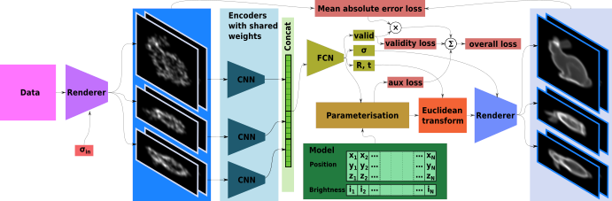
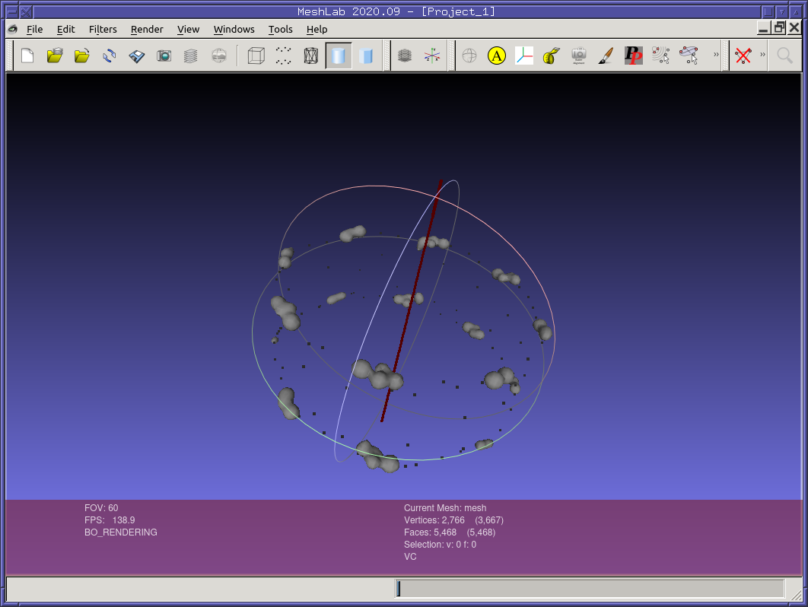

# SQUASSH

SQUASSH (Simultaneous QUAntification of Structure and Structural Heterogeneity)
is a method for extracting information from fluorescence microscopy datasets
with multiple images of the same type of structure (below we will refer to each
image of the same type of structure as a patch). SQUASSH analysis allows you to
extract both the shape of the structure (as a distribution of fluorophore
positions) and how it varies from observation to observation (the
heterogeneity). 

The bioarXiv paper is
[here](https://www.biorxiv.org/content/10.1101/2025.08.06.668903v1). Please
cite this paper if you are using this code in your research.


SQUASSH takes as input a number of patches of 3D data. The fitting process
creates an output structure and an output heterogeneity distribution. As part
of this, for each patch the rotation, translation and heterogeeity of that
specific instance of the structural model are fitted. The data can also be
controlled for quality, with patches which fall below a user-defined quality
metric filtered out during the fitting process. 



## Trying out SQUASSH on Colab

[Try training nuclear pore complexes here!](https://colab.research.google.com/github/edrosten/squassh/blob/master/train_nupc.ipynb)

The simplest way to try out SQUASSH is to run the Google CoLab notebook above,
which will run the analysis of the
[RESI](https://www.nature.com/articles/s41586-023-05925-9) nuclear pore complex
data that is shown in our paper. You will get a warning that the notebook was
not authored by Google (as it is pulled from GitHub), and there will be a
warning that there are uncommitted changes (to ensure all runs are traceable we
generally commit before every run). The notebook should take about an hour to
run.

If you get an error 'File exists' at any point, this is due to rerunning a
CoLab notebook that partially executed. If you disconnect and delete runtime
you can run the notebook from scratch and the error should not recur.

## Using SQUASSH analysis in your own research

It may be useful to use SQUASSH analysis in your research if you want to try to
get information about how a biological structure changes or distorts. There are
three main steps that you will need to go through to perform your own SQUASSH
analysis.

1) Install a local copy of SQUASSH on your machine - see instructions below

2) Pre-process your data to a suitable format. This requires extracting the
patches, each of which contains one instance of the structure to be fitted.

3) Design a heterogeneity parametrisation to describe the variation that you see in your sample.

A number of heterogeneity parametrisations are included in the codebase
including stretch along an axis, circular harmonic distortion and structures
with multiple repeats in the field of view. If you would like assistance
designing a custom heterogeneity parametrisation do get in touch.

## Requirements for running locally

This code has only been extensively tested on Linux (Mint and Ubuntu). We
provide a specfic list of packages for installation for two reasons: it
guarantees that the exact results shown in our paper are reproducible, and
performance of our code relies on torch compile, which is not recommended to
use with the latest version of python. The latest python 3.11 is well tested
but other versions should work too. All the code is know to run on torch 2.2.1.
Newer python versions (e.g. 3.13) may not work with this version of torch. 

If you want to train you will need a GPU. The examples were all tested on a
2080Ti (11GB RAM), so may not run on a GPU with less RAM without modification.
The code will execute on a CPU, but will be too slow to be useful in most cases.
Note, 10 series GPUs such as the 1080Ti and Quadro P400 will not work as-is,
because GPU use relies on torch.compile in order to have reasonable batch sizes. 

You will need a program for viewing 3D models in PLY format.
[Meshlab](https://www.meshlab.net/) is a very good choice.


## Getting SQUASSH

You will need [git LFS](https://github.com/git-lfs/git-lfs/tree/main) if you
want to get the sample data and be able to run the examples. On apt
based Linux distributions you can install it with `sudo apt install git-lfs`.
See below for instructions for macs.

Then get SQUASSH with:
```
git clone https://github.com/edrosten/SQUASSH
```

## Installing the dependencies

You will need python 3.11. [Pyenv](https://github.com/pyenv/pyenv) is often a
good choice for getting specific python versions.

SQUASSH depends on a number of packages. You can install them with:

```
pip install -r requirements.txt
```

If you want to use the latest version of the packages instead of the version
used for the results in the paper, you can use:

```
pip install -r requirements.in
```


## Running SQUASSH for the first time

To get started, running SQUASSH on RESI data of nuclear pore complexes, run:
```
python train_nupc.py
```
Output from the execution will be in the `log/` directory. The file name will be
the timestamp that the run started followed by the current version of the
respoitory.

Note this may take some time, but you can skip to the next step straight away.

## Analyzing the results

Since SQUASSH can take hours to run, the results of some previous runs have 
been provided. For example a run of the RESI data is provided in `sample_logs/1711985336-4d7cc96effb6e4740278bd39261837986110b4a2/`.

To view the raw point cloud (brightnesses not shown), along with the learned
axis, open
`sample_logs/1711985336-4d7cc96effb6e4740278bd39261837986110b4a2/run-000-phase_1/final.ply`
in meshlab. 

A more useful thing is a mesh of the isosurface of the model. You can get this
by running:
```
./render_marching_cubes.py -r 2 -t .2 sample_logs/1711985336-4d7cc96effb6e4740278bd39261837986110b4a2/run-000-phase_1/final_model.txt -o tmp/mesh.ply
```
This will create an output file `tmp/mesh.ply`, which you can open in
meshlab. If you open both files, you can see the mesh and axis. It will look
something like this:




Further analysis will depend on the specifics of the data and what information
you want to extract. A complete example is given in `figure_2_plot_nupc.py`. If
you run this it will output the following files:
```
tmp/figure2_bates.svg
tmp/figure2_bates_3d.ply
tmp/figure2_historgram.svg
tmp/figure2_resi.svg
tmp/figure2_resi_3d.ply
tmp/figure2_z_correlation.svg
```
which form the panels in figure 2 of the paper.

## Continuing on

The training schemes for the datasets used in the paper are provided in the
following files, all of which can be readily run:
```
train_bunny.py
train_dan_microtubules.py
train_legant.py
train_nupc.py
train_spectrin.py
```

There is no configuration system. If you wish to run SQUASSH on the
4Pi-STORM data, you will need to edit `train_nupc.py`, and uncomment line 15.


Note that if the repository is not clean (i.e. uncommitted changes or untracked
files), training will not execute. This ensures that every run is traceable to a
precise and complete version of the source code and data.


# Other operating systems

On Macs, you will need to install git lfs. If you have
[homebrew](https://brew.sh/), you can install it with:

```
brew install git-lfs
git-lfs pull
git lfs install
```

The pip install commands above should then create a suitable environment. Then you can install the specific requirements of the package:

```
pip install -r requirements.in
```

On Windows, you will need to install git before you start. Training requires
`torch.compile` which does not work by default.
